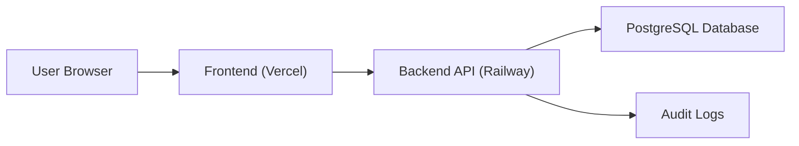
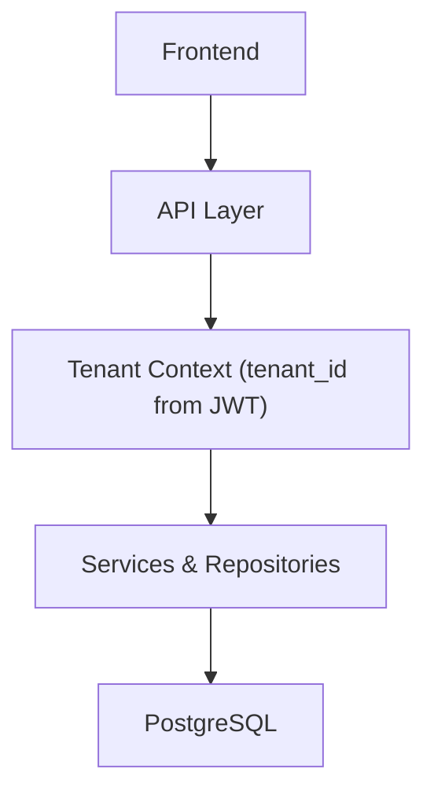
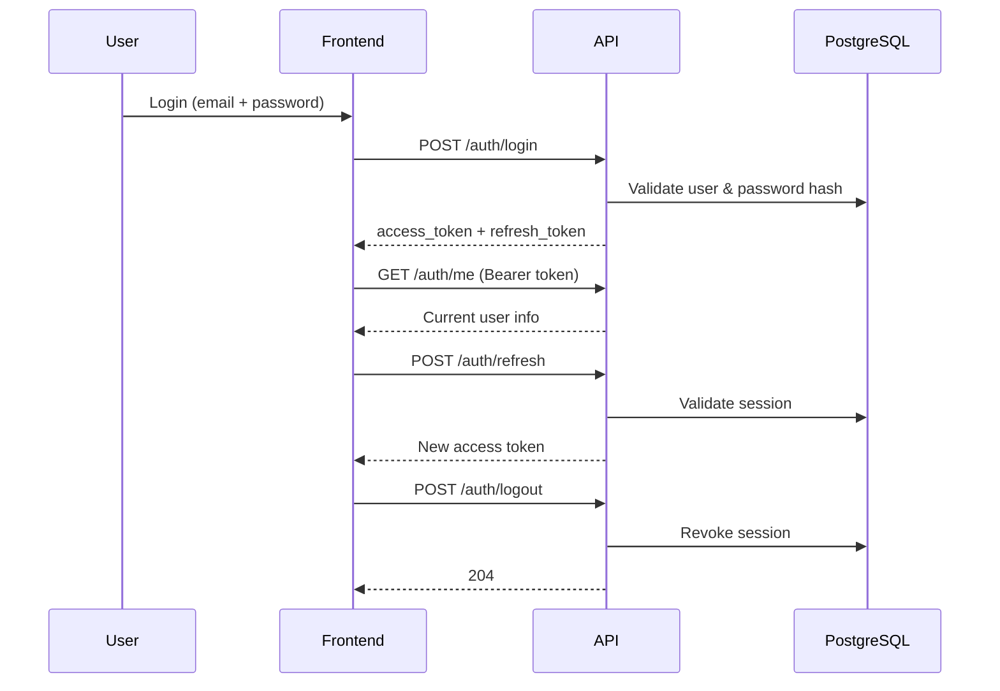

# ARCHITECTURE (Phase 1)

## Goal
Create a stable, secure, and extensible CRM foundation that supports:
- Multi-tenancy (tenant isolation)
- JWT authentication with refresh tokens
- Role-Based Access Control (RBAC)
- Audit logging
- Documented REST API (OpenAPI / Swagger)
- Base frontend for authentication and navigation

---

## Technology Stack
- Frontend: React (Vite) on Vercel
- Backend: NestJS (TypeScript) on Railway
- Database: PostgreSQL on Railway
- ORM: TypeORM with migrations
- Auth: JWT access + refresh tokens, bcrypt
- Authorization: RBAC (roles + permissions)
- API Docs: Swagger at /api/docs

---

## High-level Architecture

---

## Multi-tenant Architecture

---

## Authentication Flow

---

## Architectural Decisions
- NestJS chosen for modular structure and long-term scalability.
- PostgreSQL schema supports multi-tenancy via tenant_id on tenant-scoped tables.
- Migrations used in production (synchronize disabled).
- Passwords stored as bcrypt hashes.
- Refresh tokens tracked in sessions table (hashed + revocable).
- RBAC enforced via roles + permissions mapping.
- Audit logs for traceability of sensitive actions.

---

## Deployment Overview
- Frontend: Vercel
- Backend: Railway
- Database: Railway PostgreSQL
- TLS/HTTPS: platform-managed
- Environment variables: platform secrets

---

## Phase 1 Scope
Phase 1 focuses on the foundation (DB schema, auth model, RBAC model, documentation).
UI/UX and business-specific features are developed in later phases.
